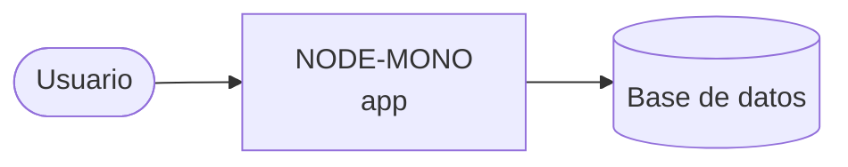

# Arquitectura

_Proyecto: **NODE-MONO** · Stack: **Express 5 / TypeScript / Node.js 22 / pnpm**_

## Diagrama C4 — Context

## Dominio
Insight AI Backend is a multi-tenant AI-powered application backend designed to generate reports from real database information using natural language as a query interface. Its objective is to connect operational data with a conversational experience, allowing users to explore, summarize, and transform information into useful reports for each tenant.

## Infraestructura
The Insight AI Backend is a Node.js/TypeScript application built with a Hexagonal Architecture in a pnpm monorepo. It provides an HTTP API using Express and manages persistence with TypeORM and PostgreSQL 16. The system is designed for multitenant AI-driven report generation.

> Actualizar con: `agentic context --full` tras cambios en el TLM.
